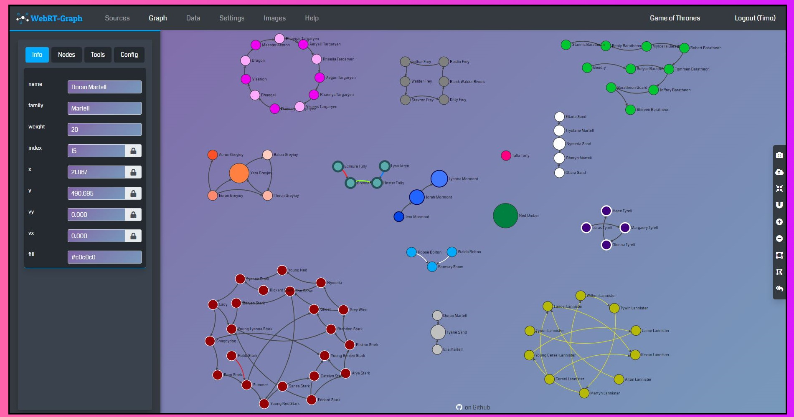

# WebRT-Graph 
WebRT-Graph is a user-based web-application to analyze and visualize graph networks. 

It's easy to use and designed to create beautiful graphs from arbitrary data.

Just import your data and define what fields are the nodes & links. That's it! 

## WebRT-Graph let's you:
* **From Scratch** - start a new graph from scratch with no data

* **Import** - or import any structured data like JSON, XML & CSV files

* **Edit** - add or remove nodes and links

* **Design** - change color or sizes of your graph or add images on your nodes

* **Share** - share your graph with other user to work together on it

* **Export** - the graph as JSON or as an Image

* **And More** - directed & undirected graphs, linear & curved links, weighted nodes, etc..
---
## Examples

***

---
## How to use WebRT-Graph
### For developers (simple guide)
WebRT-Graph is based on 
[Node.js](https://github.com/nodejs "Node.js Github")
and uses [RethinkDB](https://github.com/rethinkdb/rethinkdb "RethinkDB Github")
as data store. 

- install and run rethinkdb

- edit `database.json` (root directory) to define rethinkdb connection data

- start application with `npm run start`

- open `http://localhost:8080` in your browser

### For non-developers (a little bit more detailed guide)

You'll need to download [Node.js](https://nodejs.org/de/ "Node.js")
and [RethinkDB](https://rethinkdb.com/ "RethinkDB") first.

- download [RethinkDB](https://rethinkdb.com/docs/install/) 
and follow [the install manual](https://rethinkdb.com/docs/install/)

- download [Node.js](https://nodejs.org/de/) and run the setup file

- download [WebRT-Graph](https://github.com/xoned1/WebRT-Graph/archive/master.zip) and extract the .zip file

- open your command line tool and go into the root directory of `webrt-graph-master` 

- edit `database.json` (root directory) to define RethinkDB connection data

- type in your command line window `npm run start` to start the application

- open `http://localhost:8080` in your browser
